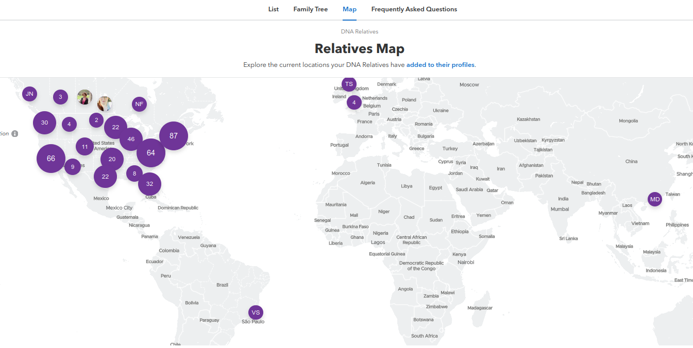

## Learning Objectives

* Learn to use online Genealogy resources
* Construct a genealogy of yourself or someone you know 

# Genetic Ancestors - DNA matching

All of the DNA testing services offer the option of comparing your DNA seqeunces to others in their database. This is particularly useful for identifying people with common ancestors in the last 5-8 generations. As you can see in the graphs above, just because you don't share DNA after 3-4 generations, does not mean you are not related. Conversely if you share some small blocks of DNA it does not mean you have a common ancestor. 

The two companies with the largest databases, Ancestry and 23andMe, do not allow for DNA results from other companies to be uploaded. However, the smaller companies (MyHeritage, Geni, FamilyTreeDNA) allow for 23andMe results to be uploaded to their databases. 

### DNA matching on Ancestry

Here is an example of the top level of DNA matches on Ancestry. 

If both you and the person you share DNA with have built trees on Ancestry and if both trees contain a common ancestor, Ancestry will show you the most recent common ancestor.

You can see how much DNA you share by clicking on the amount of centimorgans.

If you click on the person and then on shared matches, your shared ancestors are listed

Go back to the DNA dropdown menu and select ThruLines.  This provides a more compact view of relative shared. 

You can read more about DNA matching on Ancestry https://www.ancestry.com/dna/resource/whitePaper/AncestryDNA-Matching-White-Paper.pdf

## DNA matching on 23andMe

23andMe also provides a list of shared matches to their database and calculates percent relatedness and the family relationship. 

Until recently 23andMe did not have a geneaology service (see below for the beta software)  However, it does have features not included on the Ancestry site like a chromosome browser to visual the position of the shared matches. Below is a son in relationship to his parents. Not surprising he inherited his X chromosome from his mother.

Below is his relationship to his grandparents. Due to recombination he has inherited parts of most chromosomes from both grandparents, but for some of the small chromosomes he only has matches to one grandparent.

Below is his relationship to his brothers. He can see the sections of DNA where he shares SNPs and the areas where his is unique.

## 23andME family tree and map

Your 23andMe results will include a new software tool that will predict your genetic relationships and build a tree. 

While it is a good place to start, it is still in development (I can't move the image in one of my browsers and it keeps deleting the information I have added) and not always accurate. Why not just build your tree on your own from your family historical data and other online resources? 

23andMe also includes a map of relatives you share DNA with. Not surprising mine are mostly in the US because that is 23andMe's customer base and many of my ancestral lineages go back to the 1600s. 

# Genealogies

One of life’s biggest mysteries, “where did I come from?” is now a puzzle almost anyone can piece together, at least when it comes to your ancestry. With the evolution of the Internet, genealogy has become a hot hobby. Genealogy is now the second most popular hobby in the U.S. after gardening, and the second most visited category of website. It's a billion dollar industry that has spawned television shows, scores of books and the advent of over-the-counter genetic test kits. Constructing a genealogy will be useful in this class for interpreting 23andMe ancestry and trait-based results. There are many resources available not only the ones mentioned in the online sites, but Google, Facebook and the White Pages.

## Popular Web Sites and Open Source Software for Constructing Genealogies

Open Genealogy Software

* <a href="https://gramps-project.org/" target="_blank">GRAMPS Open Source Genealogy Software</a>
* <a href="https://gramps-project.org/wiki/index.php?title=Start_with_Genealogy" target="_blank">Getting started with Gramps</a>
 

Online Genealogy Software and Resources

* <a href="https://www.wikitree.com/" target="_blank">WikiTree</a> Free
* <a href="https://www.familysearch.org" target="_blank">Family Search</a> Free
* <a href="http://www.ancestry.com" target="_blank">Ancestry</a> Free 14 day trial (subscription afterwards)
* <a href="http://www.myheritage.com" target="_blank">MyHeritage</a> (Free Basic Plan with 100 members)

## GEDcom files

GEDCOM (GEnealogical Data COMmunications) is a data structure created for storing and exchanging genealogical information so that many different computer programs can use it. It is identified by the file type ".ged". GEDcom files are text files that contain the information and linkages necessary to exchange genealogical data between two entities. The entities may use the same or different software application. As a text-based file, it is easily transmitted as an attachment to e-mails or downloaded from web sites. Most programs for family history can export and import GEDCOM (.ged) files. For example a genealogy constructed on Ancestry can be downloaded and opened in GRAMPS (or vice versa).

GEDcom import/export instructions

* <a href="https://support.ancestry.com/s/article/Uploading-and-Downloading-Trees" target="_blank">Ancestry GEDcom Import/Export</a>
* <a href="http://www.myheritage.com/help-center#/path/951685261" target="_blank">MyHeritage GEDcom Import/Export</a>

# Exercises

## Exercise 1

This is a good time to learn more about your families genealogical and medical history. The Ancestry online database includes census, birth and death, marriage and other records. The US Census is particularly useful in the US for 1850-1950, for identifying family members living together. Ancestry includes recent (last 50 years) phone and address related records.  The UMass libraries has [genealogical sources](https://guides.library.umass.edu/genealogy), including access to the [Ancestry database](https://www.ancestrylibrary.com/) (but it does not automatically add records to your tree). This is useful once your free Ancestry subscription expires.  I also have used Facebook and Public Records 360 to find recent living relations - http://www.publicrecords360.com/. If you are adopted, feel free to use your adopted parent's genealogy. 

Construct a genealogy going back 4 generations of yourself or the DNA testing kit you are working with. Use Ancestry (you can use the resources on other sites) or GRAMPS to make the genealogy. If you anticipate having problems putting the genealogy together for any reason please contact me. Include images of this tree in your final report (due at the end of the semester).

