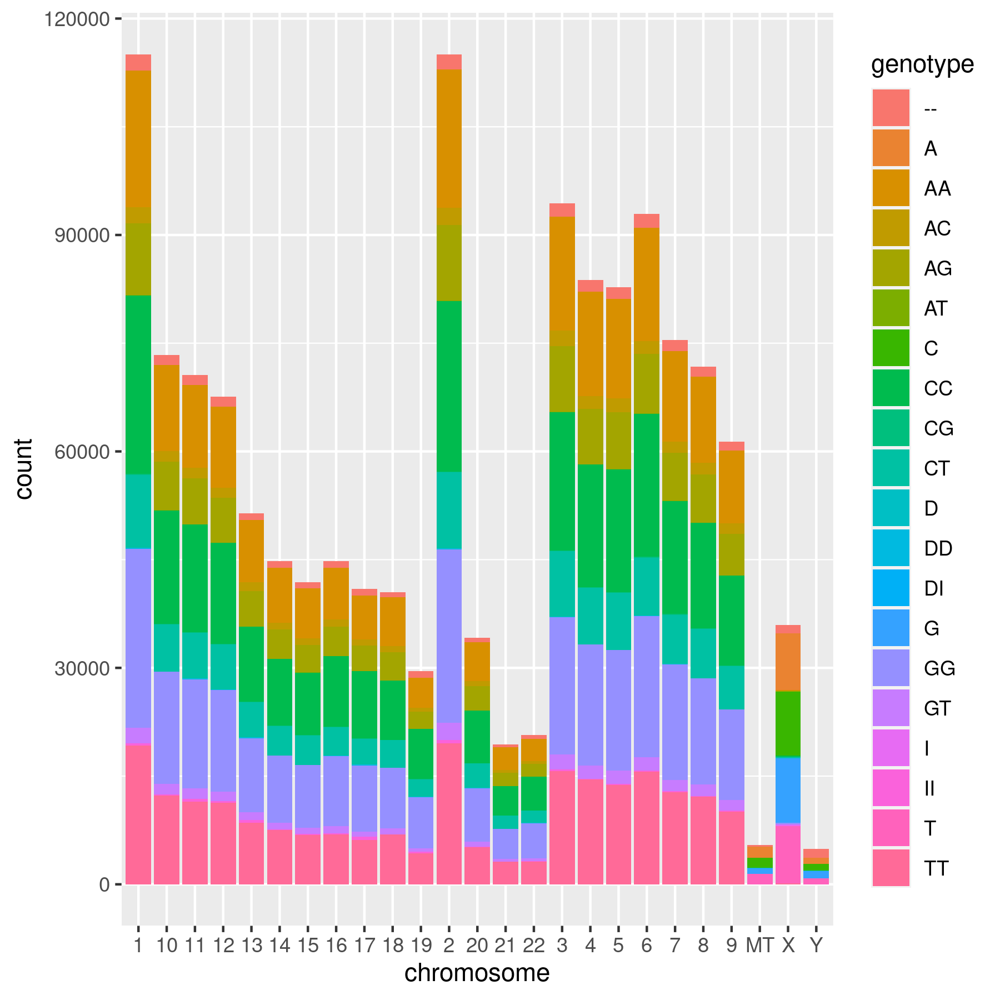

## Learning objectives

-   Be able to add title, axis labels, legends, colors to ggplot graphs
-   Resize graphs in RMarkdown
-   Print graphics to a file (e.g. jpeg, pdf)
-   Loading images into a RMarkdown file
-   Making interactive graphs and in RMarkdown

## Fine tuning ggplots

Today we will use the <a href="http://www.cookbook-r.com/Graphs/">Cookbook for R by Winston Chang</a> for tidying up our graphs. Please take your time and go through the following web pages. Copy and paste the example code into R Studio.

-   <a href="http://www.cookbook-r.com/Graphs/Titles_(ggplot2)/">Cookbook for R - Title</a>
-   <a href="http://www.cookbook-r.com/Graphs/Axes_(ggplot2)/">Cookbook for R - Axes</a>
-   <a href="http://www.cookbook-r.com/Graphs/Legends_(ggplot2)/">Cookbook for R - Legends</a>
-   <a href="http://www.cookbook-r.com/Graphs/Colors_(ggplot2)/">Cookbook for R - Colors</a>

Here are a couple of cheatsheets that can be useful

-   <a href="http://www.rstudio.com/wp-content/uploads/2015/12/ggplot2-cheatsheet-2.0.pdf">R Studio ggplot2 cheatsheet</a>
-   <a href="https://rstudio.com/wp-content/uploads/2016/03/rmarkdown-cheatsheet-2.0.pdf">RMarkdown cheatsheet</a>

### Controlling graph size in RMarkdown

In the opening line of the RMarkdown code chunk {r} you can control the output of the code, graphs, tables using knitr syntax. For example if {r, eval = FALSE} the code will not be run, but will be shown. If {r, code = FALSE} the code will not be shown, but will be run and the output will be shown (useful in reports where the reader is only interested in the results/graphs, but not the code). You can also suppress error messages and warnings so that the reader isn't bothered by them (but you should take notice).

The dimensions of an individual graph in the RMarkdown document be adjusted by specifying the graph dimensions as below.

```{r, message = FALSE}
# Load Libraries
library(tidyverse)
```

```{r}
# Load SNP file and convert genotype and chromosome to factors
SNPs_23andMe <- read_tsv("data/23andMe_complete.txt", comment = '#', col_names = FALSE) %>% 
  setNames(c("rsid","chromosome","position","genotype")) %>% 
  mutate(chromosome = as.factor(chromosome)) %>% 
  mutate(genotype = as.factor(genotype)) 
```

```{r, fig.width = 8, fig.height = 2}
# to adjust figure size {r, fig.width = 8, fig.height = 2}
ggplot(data = SNPs_23andMe, mapping = aes(x = genotype)) + 
  geom_bar() + 
  ggtitle("Total SNPs for each genotype") +
  ylab("Total number of SNPs") +
  xlab("Genotype")
```

```{r, fig.width = 4, fig.height = 4}
# to adjust figure size {r, fig.width = 3, fig.height = 3}
ggplot(data = SNPs_23andMe, mapping = aes(x = genotype)) + 
  geom_bar() + 
  ggtitle("Total SNPs for each genotype") +
  ylab("Total number of SNPs") +
  xlab("Genotype")
```

### Graphic Output

You may have realized that you can export plots in R Studio by clicking on Export in the Plots window that appears after you make a graph. You can save as a pdf, svg, tiff, png, bmp, jpeg and eps. You can also write the output directly to a file. This is particularly useful for controling the final dimensions in a reproducible way and for manuscripts.

-   <a href="http://www.cookbook-r.com/Graphs/Output_to_a_file/">Cookbook for R - Output to a file - PDF, PNG, TIFF, SVG </a>

```{r}
# Plot graph to a pdf outputfile
pdf("images/SNP_example_plot.pdf", width=6, height=3)
ggplot(data = SNPs_23andMe) + 
  geom_bar(mapping = aes(x = chromosome, fill = genotype))
dev.off()
```

```{r}
# Plot graph to a png outputfile
ppi <- 300
png("images/SNP_example_plot.png", width=6*ppi, height=6*ppi, res=ppi)
ggplot(data = SNPs_23andMe) + 
  geom_bar(mapping = aes(x = chromosome, fill = genotype))
dev.off()
```

For more details on sizing output <a href="http://www.cookbook-r.com/Graphs/Output_to_a_file/">Cookbook for R - Output to a file - PDF, PNG, TIFF, SVG </a>

### RMarkdown loading images

Sometimes it is useful in controling the image layout for a report to file with the graph and then subsequently load it into the .Rmd file. This works with png files, but not pdfs. You can also upload images made with other bioinformatic tools into your RMarkdown report.

```{r eval = FALSE}
# This is the RMarkdown style for inserting images
# Your image must be in your working directory
# This command is put OUTSIDE the r code chunk

 
```


Another way to present a graph without the code is adding echo = FALSE within the r{} chunk - {r echo = FALSE}. This prevents code, but not the results from appearing in the knitr file.

### Interactive graphs in RMarkdown reports

With plotly/ggplotly (<https://plot.ly/ggplot2/>) you can make interactive graphs in your lab report.

```{r}
library(plotly)
```

```{r, message=FALSE, eval = FALSE}
# Version 1 1
p <- ggplot(data = iris, aes(x = Sepal.Length, y = Sepal.Width, color = Species)) + 
  geom_point()
ggplotly(p)
```

```{r, message=FALSE}
# Version 2
ggplotly(
  ggplot(data = iris, aes(x = Sepal.Length, y = Sepal.Width, color = Species)) + 
    geom_point()
 )
```


## Exercises

Pay attention to how your graphs look in today's final knitted lab report. You will be docked points if the graphs do not look nice (e.g. overlapping column names, truncated legends, ets.)

### Exercise 1

Using ggplot make a make a bar graph of the total SNP counts for each chromosome. Add title and labels for the x and y axis. Set the fill of the bars to yellow and the outline (color) to black.

### Exercise 2

Modify ex1 to make a stacked bar graph with the contributions of each genotype to the total SNP count (Hint: use fill).

### Exercise 3

Turn ex2 into an interactive graph using plotly. Note: Titles in plotly often need to be wrapped. I do this using `labs(title = str_wrap("Total number of SNPs on each chromosome", 40)`.

### Exercise 4

Use `facet_wrap` to show each genotype as a separate graph (with a bar plot of counts per chromosomes).

### Exercise 5

Revise ex4 using `scales="free_y"` in `facet_wrap` to allow better show the variation in each graph.

### Exercise 6

Using the graph you made in ex2 output a PNG file with the ppi = 300 and the appropriate width and height so the image looks nice.

### Exercise 7

Load the png file of the graph from your images folder into your RMarkdown document.
